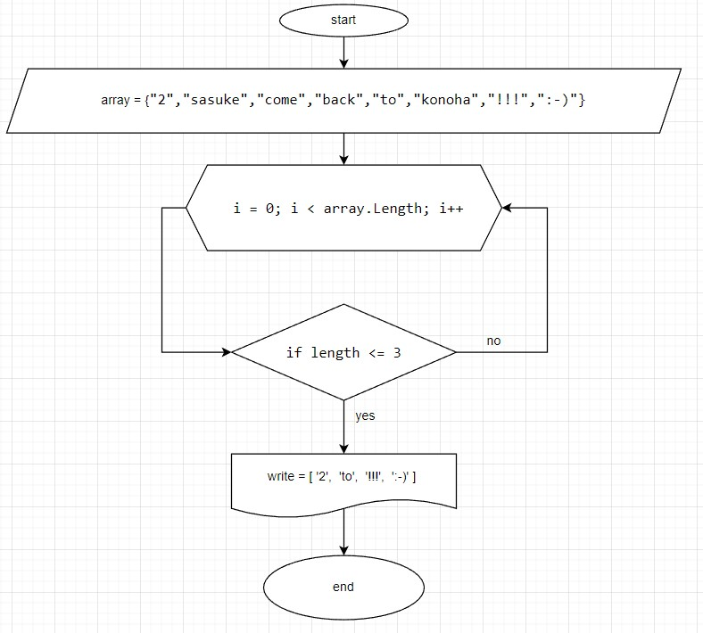

# Задача
**Написать программу, которая из имеющегося массива строк формирует массив из строк, длинна которых меньше либо равна 3 символа.**
*Первоначальный массив можно ввести с клавиатуры, либо задать на старте выполнения алгоритма. При решении не рекомендуется пользоваться коллекциями, лучше обойтись исключительно массивами*

# Блок-схема алгоритма

# Текстовое описание решения задачи

1. создаем заполненный массив типа стринг: 
*string[] array = { "2", "sasuke", "come", "back", "to", "konoha", "!!!", ":-)" }*
2. с  помощью цикла *for* перебираем наш массив по элементам
3. с помощью цикла *if* мы отбираем все элемента массива которые <= 3
4. и элементы которые подошли под наши условия мы выводим пользователю в консоль 
